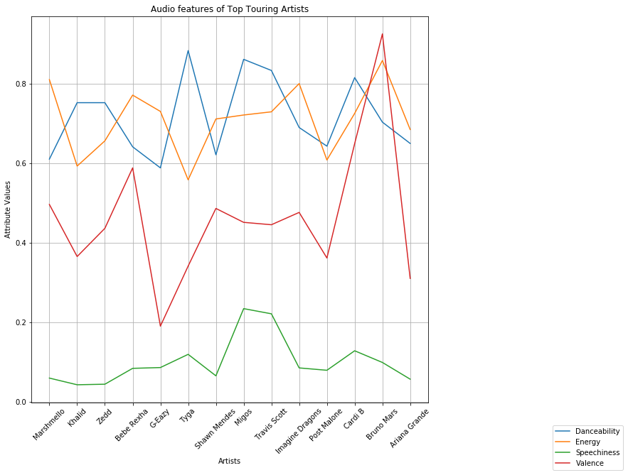
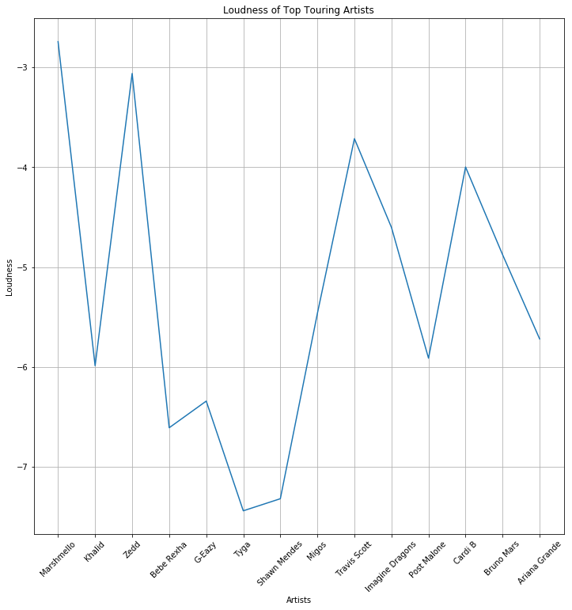

### Import Dependencies


```python
import json
import requests
import pandas as pd
import numpy as np
import matplotlib.pyplot as plt
from bs4 import BeautifulSoup as bs
from sqlalchemy import create_engine
```

### Read the data from 1st data source


```python
# Read the data from CSV file 
spotdf = pd.read_csv("Resources/top2018.csv")
```


```python
# Create and display the dataframe
newspot_df = spotdf.drop(columns=['id','key','mode','acousticness','instrumentalness','liveness','tempo','duration_ms','time_signature'])
newspot_df = newspot_df.rename(columns={"name":"Name","artists":"Artist","danceability":"Danceability","energy":"Energy","loudness":"Loudness","speechiness":"Speechiness","valence":"Valence"})
newspot_df
```
<table border="1" class="dataframe">
  <thead>
    <tr style="text-align: right;">
      <th></th>
      <th>Name</th>
      <th>Artist</th>
      <th>Danceability</th>
      <th>Energy</th>
      <th>Loudness</th>
      <th>Speechiness</th>
      <th>Valence</th>
    </tr>
  </thead>
  <tbody>
    <tr>
      <th>0</th>
      <td>God's Plan</td>
      <td>Drake</td>
      <td>0.754</td>
      <td>0.449</td>
      <td>-9.211</td>
      <td>0.1090</td>
      <td>0.3570</td>
    </tr>
    <tr>
      <th>1</th>
      <td>SAD!</td>
      <td>XXXTENTACION</td>
      <td>0.740</td>
      <td>0.613</td>
      <td>-4.880</td>
      <td>0.1450</td>
      <td>0.4730</td>
    </tr>
    <tr>
      <th>2</th>
      <td>rockstar (feat. 21 Savage)</td>
      <td>Post Malone</td>
      <td>0.587</td>
      <td>0.535</td>
      <td>-6.090</td>
      <td>0.0898</td>
      <td>0.1400</td>
    </tr>
    <tr>
      <th>3</th>
      <td>Psycho (feat. Ty Dolla $ign)</td>
      <td>Post Malone</td>
      <td>0.739</td>
      <td>0.559</td>
      <td>-8.011</td>
      <td>0.1170</td>
      <td>0.4390</td>
    </tr>
    <tr>
      <th>4</th>
      <td>In My Feelings</td>
      <td>Drake</td>
      <td>0.835</td>
      <td>0.626</td>
      <td>-5.833</td>
      <td>0.1250</td>
      <td>0.3500</td>
    </tr>
    <tr>
      <th>5</th>
      <td>Better Now</td>
      <td>Post Malone</td>
      <td>0.680</td>
      <td>0.563</td>
      <td>-5.843</td>
      <td>0.0454</td>
      <td>0.3740</td>
    </tr>
    <tr>
      <th>6</th>
      <td>I Like It</td>
      <td>Cardi B</td>
      <td>0.816</td>
      <td>0.726</td>
      <td>-3.998</td>
      <td>0.1290</td>
      <td>0.6500</td>
    </tr>
    <tr>
      <th>7</th>
      <td>One Kiss (with Dua Lipa)</td>
      <td>Calvin Harris</td>
      <td>0.791</td>
      <td>0.862</td>
      <td>-3.240</td>
      <td>0.1100</td>
      <td>0.5920</td>
    </tr>
    <tr>
      <th>8</th>
      <td>IDGAF</td>
      <td>Dua Lipa</td>
      <td>0.836</td>
      <td>0.544</td>
      <td>-5.975</td>
      <td>0.0943</td>
      <td>0.5100</td>
    </tr>
    <tr>
      <th>9</th>
      <td>FRIENDS</td>
      <td>Marshmello</td>
      <td>0.626</td>
      <td>0.880</td>
      <td>-2.384</td>
      <td>0.0504</td>
      <td>0.5340</td>
    </tr>
    <tr>
      <th>10</th>
      <td>Havana</td>
      <td>Camila Cabello</td>
      <td>0.765</td>
      <td>0.523</td>
      <td>-4.333</td>
      <td>0.0300</td>
      <td>0.3940</td>
    </tr>
    <tr>
      <th>11</th>
      <td>Lucid Dreams</td>
      <td>Juice WRLD</td>
      <td>0.511</td>
      <td>0.566</td>
      <td>-7.230</td>
      <td>0.2000</td>
      <td>0.2180</td>
    </tr>
    <tr>
      <th>12</th>
      <td>Nice For What</td>
      <td>Drake</td>
      <td>0.586</td>
      <td>0.909</td>
      <td>-6.474</td>
      <td>0.0705</td>
      <td>0.7570</td>
    </tr>
    <tr>
      <th>13</th>
      <td>Girls Like You (feat. Cardi B)</td>
      <td>Maroon 5</td>
      <td>0.851</td>
      <td>0.541</td>
      <td>-6.825</td>
      <td>0.0505</td>
      <td>0.4480</td>
    </tr>
    <tr>
      <th>14</th>
      <td>The Middle</td>
      <td>Zedd</td>
      <td>0.753</td>
      <td>0.657</td>
      <td>-3.061</td>
      <td>0.0449</td>
      <td>0.4370</td>
    </tr>
    <tr>
      <th>15</th>
      <td>All The Stars (with SZA)</td>
      <td>Kendrick Lamar</td>
      <td>0.698</td>
      <td>0.633</td>
      <td>-4.946</td>
      <td>0.0597</td>
      <td>0.5520</td>
    </tr>
    <tr>
      <th>16</th>
      <td>no tears left to cry</td>
      <td>Ariana Grande</td>
      <td>0.699</td>
      <td>0.713</td>
      <td>-5.507</td>
      <td>0.0594</td>
      <td>0.3540</td>
    </tr>
    <tr>
      <th>17</th>
      <td>X</td>
      <td>Nicky Jam</td>
      <td>0.595</td>
      <td>0.773</td>
      <td>-4.736</td>
      <td>0.0549</td>
      <td>0.7110</td>
    </tr>
    <tr>
      <th>18</th>
      <td>Moonlight</td>
      <td>XXXTENTACION</td>
      <td>0.921</td>
      <td>0.537</td>
      <td>-5.723</td>
      <td>0.0804</td>
      <td>0.7110</td>
    </tr>
    <tr>
      <th>19</th>
      <td>Look Alive (feat. Drake)</td>
      <td>BlocBoy JB</td>
      <td>0.922</td>
      <td>0.581</td>
      <td>-7.495</td>
      <td>0.2700</td>
      <td>0.5950</td>
    </tr>
    <tr>
      <th>20</th>
      <td>These Days (feat. Jess Glynne, Macklemore &amp; Da...</td>
      <td>Rudimental</td>
      <td>0.653</td>
      <td>0.809</td>
      <td>-4.057</td>
      <td>0.0474</td>
      <td>0.5500</td>
    </tr>
    <tr>
      <th>21</th>
      <td>Te Bot? - Remix</td>
      <td>Nio Garcia</td>
      <td>0.903</td>
      <td>0.675</td>
      <td>-3.445</td>
      <td>0.2140</td>
      <td>0.4420</td>
    </tr>
    <tr>
      <th>22</th>
      <td>Mine</td>
      <td>Bazzi</td>
      <td>0.710</td>
      <td>0.789</td>
      <td>-3.874</td>
      <td>0.0722</td>
      <td>0.7170</td>
    </tr>
    <tr>
      <th>23</th>
      <td>Youngblood</td>
      <td>5 Seconds of Summer</td>
      <td>0.596</td>
      <td>0.854</td>
      <td>-5.114</td>
      <td>0.4630</td>
      <td>0.1520</td>
    </tr>
    <tr>
      <th>24</th>
      <td>New Rules</td>
      <td>Dua Lipa</td>
      <td>0.762</td>
      <td>0.700</td>
      <td>-6.021</td>
      <td>0.0694</td>
      <td>0.6080</td>
    </tr>
    <tr>
      <th>25</th>
      <td>Shape of You</td>
      <td>Ed Sheeran</td>
      <td>0.825</td>
      <td>0.652</td>
      <td>-3.183</td>
      <td>0.0802</td>
      <td>0.9310</td>
    </tr>
    <tr>
      <th>26</th>
      <td>Love Lies (with Normani)</td>
      <td>Khalid</td>
      <td>0.708</td>
      <td>0.648</td>
      <td>-5.626</td>
      <td>0.0449</td>
      <td>0.3380</td>
    </tr>
    <tr>
      <th>27</th>
      <td>Meant to Be (feat. Florida Georgia Line)</td>
      <td>Bebe Rexha</td>
      <td>0.642</td>
      <td>0.772</td>
      <td>-6.610</td>
      <td>0.0848</td>
      <td>0.5890</td>
    </tr>
    <tr>
      <th>28</th>
      <td>Jocelyn Flores</td>
      <td>XXXTENTACION</td>
      <td>0.872</td>
      <td>0.391</td>
      <td>-9.144</td>
      <td>0.2420</td>
      <td>0.4370</td>
    </tr>
    <tr>
      <th>29</th>
      <td>Perfect</td>
      <td>Ed Sheeran</td>
      <td>0.599</td>
      <td>0.448</td>
      <td>-6.312</td>
      <td>0.0232</td>
      <td>0.1680</td>
    </tr>
    <tr>
      <th>...</th>
      <td>...</td>
      <td>...</td>
      <td>...</td>
      <td>...</td>
      <td>...</td>
      <td>...</td>
      <td>...</td>
    </tr>
    <tr>
      <th>70</th>
      <td>Let Me Go (with Alesso, Florida Georgia Line &amp;...</td>
      <td>Hailee Steinfeld</td>
      <td>0.663</td>
      <td>0.708</td>
      <td>-4.154</td>
      <td>0.0473</td>
      <td>0.7420</td>
    </tr>
    <tr>
      <th>71</th>
      <td>Feel It Still</td>
      <td>Portugal. The Man</td>
      <td>0.801</td>
      <td>0.795</td>
      <td>-5.115</td>
      <td>0.0504</td>
      <td>0.7540</td>
    </tr>
    <tr>
      <th>72</th>
      <td>Pray For Me (with Kendrick Lamar)</td>
      <td>The Weeknd</td>
      <td>0.735</td>
      <td>0.677</td>
      <td>-4.979</td>
      <td>0.0930</td>
      <td>0.1880</td>
    </tr>
    <tr>
      <th>73</th>
      <td>Walk It Talk It</td>
      <td>Migos</td>
      <td>0.909</td>
      <td>0.628</td>
      <td>-5.456</td>
      <td>0.2010</td>
      <td>0.4060</td>
    </tr>
    <tr>
      <th>74</th>
      <td>Him &amp; I (with Halsey)</td>
      <td>G-Eazy</td>
      <td>0.589</td>
      <td>0.731</td>
      <td>-6.343</td>
      <td>0.0868</td>
      <td>0.1910</td>
    </tr>
    <tr>
      <th>75</th>
      <td>Candy Paint</td>
      <td>Post Malone</td>
      <td>0.670</td>
      <td>0.654</td>
      <td>-5.944</td>
      <td>0.1530</td>
      <td>0.4380</td>
    </tr>
    <tr>
      <th>76</th>
      <td>Congratulations</td>
      <td>Post Malone</td>
      <td>0.630</td>
      <td>0.804</td>
      <td>-4.183</td>
      <td>0.0363</td>
      <td>0.4920</td>
    </tr>
    <tr>
      <th>77</th>
      <td>1, 2, 3 (feat. Jason Derulo &amp; De La Ghetto)</td>
      <td>Sofia Reyes</td>
      <td>0.792</td>
      <td>0.895</td>
      <td>-3.112</td>
      <td>0.0589</td>
      <td>0.7940</td>
    </tr>
    <tr>
      <th>78</th>
      <td>Criminal</td>
      <td>Natti Natasha</td>
      <td>0.814</td>
      <td>0.813</td>
      <td>-3.023</td>
      <td>0.0561</td>
      <td>0.8390</td>
    </tr>
    <tr>
      <th>79</th>
      <td>Plug Walk</td>
      <td>Rich The Kid</td>
      <td>0.876</td>
      <td>0.519</td>
      <td>-6.531</td>
      <td>0.1430</td>
      <td>0.1580</td>
    </tr>
    <tr>
      <th>80</th>
      <td>lovely (with Khalid)</td>
      <td>Billie Eilish</td>
      <td>0.351</td>
      <td>0.296</td>
      <td>-10.109</td>
      <td>0.0333</td>
      <td>0.1200</td>
    </tr>
    <tr>
      <th>81</th>
      <td>Stir Fry</td>
      <td>Migos</td>
      <td>0.815</td>
      <td>0.816</td>
      <td>-5.474</td>
      <td>0.2690</td>
      <td>0.4980</td>
    </tr>
    <tr>
      <th>82</th>
      <td>HUMBLE.</td>
      <td>Kendrick Lamar</td>
      <td>0.908</td>
      <td>0.621</td>
      <td>-6.638</td>
      <td>0.1020</td>
      <td>0.4210</td>
    </tr>
    <tr>
      <th>83</th>
      <td>Vaina Loca</td>
      <td>Ozuna</td>
      <td>0.754</td>
      <td>0.805</td>
      <td>-4.249</td>
      <td>0.0752</td>
      <td>0.5550</td>
    </tr>
    <tr>
      <th>84</th>
      <td>Perfect Duet (Ed Sheeran &amp; Beyonc?)</td>
      <td>Ed Sheeran</td>
      <td>0.587</td>
      <td>0.299</td>
      <td>-7.365</td>
      <td>0.0263</td>
      <td>0.3560</td>
    </tr>
    <tr>
      <th>85</th>
      <td>Coraz?n (feat. Nego do Borel)</td>
      <td>Maluma</td>
      <td>0.722</td>
      <td>0.738</td>
      <td>-6.073</td>
      <td>0.2470</td>
      <td>0.7480</td>
    </tr>
    <tr>
      <th>86</th>
      <td>Young Dumb &amp; Broke</td>
      <td>Khalid</td>
      <td>0.798</td>
      <td>0.539</td>
      <td>-6.351</td>
      <td>0.0421</td>
      <td>0.3940</td>
    </tr>
    <tr>
      <th>87</th>
      <td>S?guelo Bailando</td>
      <td>Ozuna</td>
      <td>0.855</td>
      <td>0.664</td>
      <td>-7.110</td>
      <td>0.0607</td>
      <td>0.6260</td>
    </tr>
    <tr>
      <th>88</th>
      <td>Downtown</td>
      <td>Anitta</td>
      <td>0.775</td>
      <td>0.679</td>
      <td>-4.985</td>
      <td>0.1350</td>
      <td>0.6190</td>
    </tr>
    <tr>
      <th>89</th>
      <td>Bella</td>
      <td>Wolfine</td>
      <td>0.909</td>
      <td>0.493</td>
      <td>-6.688</td>
      <td>0.0735</td>
      <td>0.8440</td>
    </tr>
    <tr>
      <th>90</th>
      <td>Promises (with Sam Smith)</td>
      <td>Calvin Harris</td>
      <td>0.781</td>
      <td>0.768</td>
      <td>-5.991</td>
      <td>0.0394</td>
      <td>0.4860</td>
    </tr>
    <tr>
      <th>91</th>
      <td>Yes Indeed</td>
      <td>Lil Baby</td>
      <td>0.964</td>
      <td>0.346</td>
      <td>-9.309</td>
      <td>0.5300</td>
      <td>0.5620</td>
    </tr>
    <tr>
      <th>92</th>
      <td>I Like Me Better</td>
      <td>Lauv</td>
      <td>0.752</td>
      <td>0.505</td>
      <td>-7.621</td>
      <td>0.2530</td>
      <td>0.4190</td>
    </tr>
    <tr>
      <th>93</th>
      <td>This Is Me</td>
      <td>Keala Settle</td>
      <td>0.284</td>
      <td>0.704</td>
      <td>-7.276</td>
      <td>0.1860</td>
      <td>0.1000</td>
    </tr>
    <tr>
      <th>94</th>
      <td>Everybody Dies In Their Nightmares</td>
      <td>XXXTENTACION</td>
      <td>0.734</td>
      <td>0.570</td>
      <td>-7.066</td>
      <td>0.1330</td>
      <td>0.6890</td>
    </tr>
    <tr>
      <th>95</th>
      <td>Rewrite The Stars</td>
      <td>Zac Efron</td>
      <td>0.684</td>
      <td>0.619</td>
      <td>-7.005</td>
      <td>0.0386</td>
      <td>0.2840</td>
    </tr>
    <tr>
      <th>96</th>
      <td>I Miss You (feat. Julia Michaels)</td>
      <td>Clean Bandit</td>
      <td>0.638</td>
      <td>0.658</td>
      <td>-6.318</td>
      <td>0.0456</td>
      <td>0.3300</td>
    </tr>
    <tr>
      <th>97</th>
      <td>No Brainer</td>
      <td>DJ Khaled</td>
      <td>0.552</td>
      <td>0.760</td>
      <td>-4.706</td>
      <td>0.3420</td>
      <td>0.6390</td>
    </tr>
    <tr>
      <th>98</th>
      <td>Dusk Till Dawn - Radio Edit</td>
      <td>ZAYN</td>
      <td>0.258</td>
      <td>0.437</td>
      <td>-6.593</td>
      <td>0.0390</td>
      <td>0.0967</td>
    </tr>
    <tr>
      <th>99</th>
      <td>Be Alright</td>
      <td>Dean Lewis</td>
      <td>0.553</td>
      <td>0.586</td>
      <td>-6.319</td>
      <td>0.0362</td>
      <td>0.4430</td>
    </tr>
  </tbody>
</table>
<p>100 rows × 7 columns</p>
</div>


```python
# Group the dataframe by "Artist" and take averages
spot_df = newspot_df.groupby(["Artist"]).mean()
spot_df.head()
```
<table border="1" class="dataframe">
  <thead>
    <tr style="text-align: right;">
      <th></th>
      <th>Danceability</th>
      <th>Energy</th>
      <th>Loudness</th>
      <th>Speechiness</th>
      <th>Valence</th>
    </tr>
    <tr>
      <th>Artist</th>
      <th></th>
      <th></th>
      <th></th>
      <th></th>
      <th></th>
    </tr>
  </thead>
  <tbody>
    <tr>
      <th>5 Seconds of Summer</th>
      <td>0.5960</td>
      <td>0.8540</td>
      <td>-5.1140</td>
      <td>0.4630</td>
      <td>0.152</td>
    </tr>
    <tr>
      <th>6ix9ine</th>
      <td>0.9310</td>
      <td>0.3870</td>
      <td>-9.1270</td>
      <td>0.4120</td>
      <td>0.376</td>
    </tr>
    <tr>
      <th>Anitta</th>
      <td>0.7750</td>
      <td>0.6790</td>
      <td>-4.9850</td>
      <td>0.1350</td>
      <td>0.619</td>
    </tr>
    <tr>
      <th>Anne-Marie</th>
      <td>0.6970</td>
      <td>0.6830</td>
      <td>-2.8810</td>
      <td>0.1170</td>
      <td>0.603</td>
    </tr>
    <tr>
      <th>Ariana Grande</th>
      <td>0.6505</td>
      <td>0.6855</td>
      <td>-5.7205</td>
      <td>0.0576</td>
      <td>0.311</td>
    </tr>
  </tbody>
</table>
</div>


### Scrape the data from 2nd data source


```python
# URL to scrape the data
links = []
artists = []
base_url = 'https://247wallst.com/special-report/2019/01/10/100-most-popular-musicians-on-tour-in-2019/'
for i in range(2, 12):
    links.append(base_url + str(i))

for url in links:
    response = requests.get(url)
    soup = bs(response.text, 'html.parser')
    
    divs = soup.find_all('div', class_='pubentry-wrapper')
    for div in divs:
        artist_info = {}
        title_span = div.find('span', class_='title-bullet')
        artists_id_name = title_span.find('strong').text
        artist_id = artists_id_name.split(".")[0]
        artist_info['artist_id'] = artist_id
        artist_name = artists_id_name.split(".")[1].strip()
        artist_info['artist_name'] = artist_name
        
        bullet_spans = div.find_all('span', class_='value-bullet')
        no_of_shows = bullet_spans[0].text.strip()
        no_of_shows = no_of_shows.split(":")[1]
        artist_info['no_of_shows'] = no_of_shows
        followers = bullet_spans[1].text.strip()
        followers = followers.split(":")[1]
        artist_info['followers'] = followers
        recent_albums = bullet_spans[2].text.strip()
        recent_albums = recent_albums.split(":")[1]
        artist_info['recent_albums'] = recent_albums
        
        artists.append(artist_info)
```


```python
# Create and display the dataframe
artists_df = pd.DataFrame(artists)
artists_df.head()
```
<table border="1" class="dataframe">
  <thead>
    <tr style="text-align: right;">
      <th></th>
      <th>artist_id</th>
      <th>artist_name</th>
      <th>followers</th>
      <th>no_of_shows</th>
      <th>recent_albums</th>
    </tr>
  </thead>
  <tbody>
    <tr>
      <th>0</th>
      <td>100</td>
      <td>Incubus</td>
      <td>675,465</td>
      <td>4</td>
      <td>8 (2017)</td>
    </tr>
    <tr>
      <th>1</th>
      <td>99</td>
      <td>Kodak Black</td>
      <td>369,978</td>
      <td>1</td>
      <td>Dying to Live (2018)</td>
    </tr>
    <tr>
      <th>2</th>
      <td>98</td>
      <td>Diplo</td>
      <td>605,749</td>
      <td>19</td>
      <td>Florida (2004)</td>
    </tr>
    <tr>
      <th>3</th>
      <td>97</td>
      <td>Tyler, The Creator</td>
      <td>647,691</td>
      <td>2</td>
      <td>Flower Boy (2017)</td>
    </tr>
    <tr>
      <th>4</th>
      <td>96</td>
      <td>Wu-Tang Clan</td>
      <td>449,643</td>
      <td>4</td>
      <td>Once Upon a Time in Shaolin (2015)</td>
    </tr>
  </tbody>
</table>
</div>


```python
# Rename the columns in the dataframe
artists_df = artists_df.rename(columns={"artist_name":"Artist","artist_id":"Artist Id","followers":"# of Followers","no_of_shows":"# of Shows","recent_albums":"Recent Album"})
```

### Merge the two data sources


```python
spotipy_final = pd.merge(artists_df, spot_df, how="left", on=["Artist"])
```


```python
# Drop duplicates
spotipy_final = spotipy_final.dropna() 
```


```python
# Drop the column 'Artist Id'
spotipy_final = spotipy_final.drop(columns='Artist Id')
spotipy_final
```
<table border="1" class="dataframe">
  <thead>
    <tr style="text-align: right;">
      <th></th>
      <th>Artist</th>
      <th># of Followers</th>
      <th># of Shows</th>
      <th>Recent Album</th>
      <th>Danceability</th>
      <th>Energy</th>
      <th>Loudness</th>
      <th>Speechiness</th>
      <th>Valence</th>
    </tr>
  </thead>
  <tbody>
    <tr>
      <th>13</th>
      <td>Marshmello</td>
      <td>348,373</td>
      <td>3</td>
      <td>Joytime II (2018)</td>
      <td>0.611000</td>
      <td>0.811000</td>
      <td>-2.742000</td>
      <td>0.06030</td>
      <td>0.497000</td>
    </tr>
    <tr>
      <th>32</th>
      <td>Khalid</td>
      <td>605,494</td>
      <td>3</td>
      <td>American Teen (2017)</td>
      <td>0.753000</td>
      <td>0.593500</td>
      <td>-5.988500</td>
      <td>0.04350</td>
      <td>0.366000</td>
    </tr>
    <tr>
      <th>35</th>
      <td>Zedd</td>
      <td>887,638</td>
      <td>10</td>
      <td>True Colors (2015)</td>
      <td>0.753000</td>
      <td>0.657000</td>
      <td>-3.061000</td>
      <td>0.04490</td>
      <td>0.437000</td>
    </tr>
    <tr>
      <th>42</th>
      <td>Bebe Rexha</td>
      <td>414,348</td>
      <td>1</td>
      <td>Expectations (2018)</td>
      <td>0.642000</td>
      <td>0.772000</td>
      <td>-6.610000</td>
      <td>0.08480</td>
      <td>0.589000</td>
    </tr>
    <tr>
      <th>59</th>
      <td>G-Eazy</td>
      <td>765,101</td>
      <td>1</td>
      <td>The Beautiful &amp; Damned (2017)</td>
      <td>0.589000</td>
      <td>0.731000</td>
      <td>-6.343000</td>
      <td>0.08680</td>
      <td>0.191000</td>
    </tr>
    <tr>
      <th>62</th>
      <td>Tyga</td>
      <td>985,112</td>
      <td>3</td>
      <td>Kyoto (2017)</td>
      <td>0.884000</td>
      <td>0.559000</td>
      <td>-7.442000</td>
      <td>0.12000</td>
      <td>0.342000</td>
    </tr>
    <tr>
      <th>75</th>
      <td>Shawn Mendes</td>
      <td>766,193</td>
      <td>86</td>
      <td>Shawn Mendes (2018)</td>
      <td>0.622000</td>
      <td>0.712000</td>
      <td>-7.321000</td>
      <td>0.06600</td>
      <td>0.487000</td>
    </tr>
    <tr>
      <th>77</th>
      <td>Migos</td>
      <td>737,273</td>
      <td>4</td>
      <td>Culture II (2018)</td>
      <td>0.862000</td>
      <td>0.722000</td>
      <td>-5.465000</td>
      <td>0.23500</td>
      <td>0.452000</td>
    </tr>
    <tr>
      <th>83</th>
      <td>Travis Scott</td>
      <td>766,831</td>
      <td>30</td>
      <td>Astroworld (2018)</td>
      <td>0.834000</td>
      <td>0.730000</td>
      <td>-3.714000</td>
      <td>0.22200</td>
      <td>0.446000</td>
    </tr>
    <tr>
      <th>91</th>
      <td>Imagine Dragons</td>
      <td>1,933,268</td>
      <td>3</td>
      <td>Origins (2018)</td>
      <td>0.690500</td>
      <td>0.801000</td>
      <td>-4.603500</td>
      <td>0.08590</td>
      <td>0.477000</td>
    </tr>
    <tr>
      <th>92</th>
      <td>Post Malone</td>
      <td>803,006</td>
      <td>29</td>
      <td>Beerbongs &amp; Bentleys (2018)</td>
      <td>0.643667</td>
      <td>0.608833</td>
      <td>-5.913167</td>
      <td>0.07995</td>
      <td>0.362333</td>
    </tr>
    <tr>
      <th>96</th>
      <td>Cardi B</td>
      <td>405,615</td>
      <td>8</td>
      <td>Invasion of Privacy (2018)</td>
      <td>0.816000</td>
      <td>0.726000</td>
      <td>-3.998000</td>
      <td>0.12900</td>
      <td>0.650000</td>
    </tr>
    <tr>
      <th>98</th>
      <td>Bruno Mars</td>
      <td>2,398,515</td>
      <td>3</td>
      <td>24K Magic (2016)</td>
      <td>0.704000</td>
      <td>0.859000</td>
      <td>-4.877000</td>
      <td>0.09960</td>
      <td>0.926000</td>
    </tr>
    <tr>
      <th>99</th>
      <td>Ariana Grande</td>
      <td>1,293,586</td>
      <td>72</td>
      <td>Sweetener (2018)</td>
      <td>0.650500</td>
      <td>0.685500</td>
      <td>-5.720500</td>
      <td>0.05760</td>
      <td>0.311000</td>
    </tr>
  </tbody>
</table>
</div>


### Connect to MySQL Database


```python
# Create a connection to the database
rds_connection_string = "root:admin@127.0.0.1/spotipy"
engine = create_engine(f"mysql://{rds_connection_string}")
```

### Check if the tables exist


```python
# Display the tables in the database
engine.table_names()
```


    ['artists']


### Use pandas to load csv converted DataFrame into database


```python
spotipy_final.to_sql(name="artists", con=engine, if_exists="append", index=False)
```

### Confirm data has been added by querying the artists table


```python
pd.read_sql_query('select * from artists', con=engine).head()
```
<table border="1" class="dataframe">
  <thead>
    <tr style="text-align: right;">
      <th></th>
      <th>artist</th>
      <th># of followers</th>
      <th># of shows</th>
      <th>recent album</th>
      <th>danceability</th>
      <th>energy</th>
      <th>loudness</th>
      <th>speechiness</th>
      <th>valence</th>
    </tr>
  </thead>
  <tbody>
    <tr>
      <th>0</th>
      <td>Marshmello</td>
      <td>348,373</td>
      <td>3</td>
      <td>Joytime II (2018)</td>
      <td>0.611</td>
      <td>0.8110</td>
      <td>-2.7420</td>
      <td>0.0603</td>
      <td>0.497</td>
    </tr>
    <tr>
      <th>1</th>
      <td>Khalid</td>
      <td>605,494</td>
      <td>3</td>
      <td>American Teen (2017)</td>
      <td>0.753</td>
      <td>0.5935</td>
      <td>-5.9885</td>
      <td>0.0435</td>
      <td>0.366</td>
    </tr>
    <tr>
      <th>2</th>
      <td>Zedd</td>
      <td>887,638</td>
      <td>10</td>
      <td>True Colors (2015)</td>
      <td>0.753</td>
      <td>0.6570</td>
      <td>-3.0610</td>
      <td>0.0449</td>
      <td>0.437</td>
    </tr>
    <tr>
      <th>3</th>
      <td>Bebe Rexha</td>
      <td>414,348</td>
      <td>1</td>
      <td>Expectations (2018)</td>
      <td>0.642</td>
      <td>0.7720</td>
      <td>-6.6100</td>
      <td>0.0848</td>
      <td>0.589</td>
    </tr>
    <tr>
      <th>4</th>
      <td>G-Eazy</td>
      <td>765,101</td>
      <td>1</td>
      <td>The Beautiful &amp; Damned (2017)</td>
      <td>0.589</td>
      <td>0.7310</td>
      <td>-6.3430</td>
      <td>0.0868</td>
      <td>0.191</td>
    </tr>
  </tbody>
</table>
</div>


### Plots of Top Touring Artists 


```python
# Make lists of all the columns
artist_list = spotipy_final['Artist'].values
followers_list = spotipy_final['# of Followers'].values
danceability_list = spotipy_final['Danceability'].values
energy_list = spotipy_final['Energy'].values
loudness_list = spotipy_final['Loudness'].values
speechiness_list = spotipy_final['Speechiness'].values
valence_list = spotipy_final['Valence'].values
```


```python
# Plotting the audio features - danceability, energy, speechiness and valence
danceability_plot = plt.plot(artist_list, danceability_list, label='Danceability')
energy_plot = plt.plot(artist_list, energy_list, label='Energy')
speechiness_plot = plt.plot(artist_list, speechiness_list, label='Speechiness')
valence_plot = plt.plot(artist_list, valence_list, label='Valence')

plt.title("Audio features of Top Touring Artists")
plt.xlabel("Artists")
plt.xticks(artist_list, rotation=45)
plt.ylabel("Attribute Values")

fig_size = plt.rcParams["figure.figsize"]
fig_size[0] = 12
fig_size[1] = 12
plt.rcParams["figure.figsize"] = fig_size

plots = danceability_plot + energy_plot + speechiness_plot + valence_plot
labels = [l.get_label() for l in plots]
plt.legend(plots, labels, loc='upper right', bbox_to_anchor=(1.5, -0.05))
plt.grid()
plt.savefig("Images/Audio features of Top Touring Artists.png")
plt.show()
```





```python
# Plotting the loudness of each artist
loudness_plot = plt.plot(artist_list, loudness_list, label='Loudness')

plt.title("Loudness of Top Touring Artists")
plt.xlabel("Artists")
plt.xticks(artist_list, rotation=45)
plt.ylabel("Loudness")

fig_size = plt.rcParams["figure.figsize"]
fig_size[0] = 8
fig_size[1] = 8
plt.rcParams["figure.figsize"] = fig_size

plt.grid()
plt.savefig("Images/Loudness of Top Touring Artists.png")
plt.show()
```




